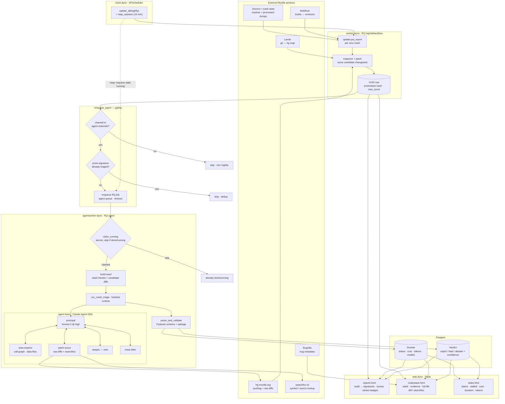

<!-- This Source Code Form is subject to the terms of the Mozilla Public
     License, v. 2.0. If a copy of the MPL was not distributed with this file,
     You can obtain one at http://mozilla.org/MPL/2.0/. -->

# Architecture: crash report → view

This is the end-to-end flow of the LLM-agent-augmented crash-clouseau, from
ingesting a crash to what the operator sees in the UI. The dyno boundaries
(`clock`, `worker`, `agentworker`, `web`) match the `Procfile`.

## Walkthrough

1. **Ingest (clock → worker).** The `clock` dyno periodically runs
   `update.update_all` scoped to `$INGEST_CHANNELS` — which has **no default**: absent
   or empty ingests nothing and logs a warning. (It used to fall back to every
   configured channel, i.e. `config.get_channels()`, which is the list that defines the
   `CHANNEL_TYPE` enum; that fired once and ingested release. `plans/20` §1.8.) For each new crash `update.put_report` writes a `UUID`
   row and `inspector` + `patch` score the candidate changesets (raw hg diffs,
   `git → hg` mapping via Lando), recording `max_score`.

2. **Gate (`enqueue_agent`).** Before spending an LLM run the crash passes two
   gates: it must be on an **agent channel** (nightly), and its
   **proto-signature** must not already have a completed dossier (dedup). Only
   then is an RQ job queued on the `agent` queue with a job timeout.

3. **Triage (agentworker).** The worker **atomically claims** the run
   (`claim_running` — skips anything already done or running, so dyno restarts
   don't double-pay), builds a seed from the crash stack + candidate diffs, and
   runs the agent team via the hackbot runtime: a principal (Sonnet 5 @ high)
   coordinating area-experts (call-graph / data-flow), patch-scout (raw diffs +
   searchfox), a skeptic (veto) and a noise-filter. The result is validated
   against the Pydantic schema and persisted as a **Dossier** (status, cost,
   tokens, models) plus a **Verdict** (culprit / lead / abstain + confidence).

4. **Resilience.** A `reap_orphans` job (every 15 min, same threshold as the
   tasks view's "stalled") requeues `running` dossiers whose worker died past
   `job_timeout` + buffer — the dotted feedback edge.

5. **Views (web).** `reports.html` shows a build's signatures with candidate
   scores and verdict badges; `crashstack.html` shows the stack, the agent's
   evidence/citations and the full-file diff (or searchfox); `tasks.html` is the
   operational view of the runs themselves — status, stalled, cost, duration and
   tokens, with a fleet summary.

## Crash report processing (detail): report → scored seed

This zooms into the **worker** stage above — exactly what `update.put_report`
does with one crash before the agent ever runs: extract the stack, resolve each
frame to a file+revision, find which recently-landed changesets touched those
files, and score them by how close the change is to the crashing line. The agent
is only invoked for a crash that comes out of this with at least one scored
candidate.

```mermaid
flowchart TD
    START([new crash uuid]) --> FETCH["Socorro ProcessedCrash.get_processed(uuid)<br/>→ json_dump, signature, build, channel, product,<br/>java_stack_trace"]
    FETCH --> HASJSON{json_dump<br/>present?}
    HASJSON -- no --> SKIP1([skip — nothing to analyze])
    HASJSON -- yes --> WINDOW["compute the build window<br/>mindate = buildid − backward_lookup_ndays (nightly),<br/>else previous build's pushdate · maxdate = buildid"]

    WINDOW --> STACK["extract the crashing thread's frames (cap 50)<br/>(Java stack handled the same way if present)"]
    STACK --> PARSE["per frame: parse the file URI<br/>hg:… / git:… → (filename, hg node)<br/>git hash → hg revision via Lando (git2hg)"]
    PARSE --> NODECHK{frame's node<br/>== build node?}
    NODECHK -- no --> DISCARD([discard the stack —<br/>node mismatch = crash during an update])
    NODECHK -- yes --> FILES["collect the set of crashing-stack files"]

    FILES --> FIND["touched-file check — Changeset.find:<br/>changesets pushed in [mindate, maxdate], this channel,<br/>non-merge, that touched a crashing-stack file<br/>→ {file: [nodes]}"]
    FIND --> AMEND{any crashing<br/>file touched?}
    AMEND -- no --> NOCAND([no candidates —<br/>off-stack / no recent change here])
    AMEND -- yes --> ATTACH["amend: attach the touching changesets<br/>to their frames → 'interesting' changesets"]

    ATTACH --> DIFF["per interesting changeset: patch.parse (parsepatch)<br/>→ added / deleted / touched line numbers<br/>(comments filtered) + isnew → Changeset.add_analyzis"]
    DIFF --> SCORE["score each crashing frame @ line × changeset:<br/>new file → MAX; else proximity of the crash line to the<br/>changed lines = max(line_score(touched), line_score(added))<br/>(+ deleted if < 5) · exact line = MAX, decays with distance<br/>→ best score per candidate, max_score per crash"]

    SCORE --> DEDUP{stack hash already<br/>seen for this<br/>build + signature?}
    DEDUP -- yes --> USELESS([mark 'useless' —<br/>duplicate stack, not enqueued])
    DEDUP -- no --> STORE["store frames + per-candidate scores (CrashStack)<br/>· set max_score · mark analyzed"]
    STORE --> ENQ["enqueue_agent(uuid, channel)<br/>(nightly + proto-dedup gates)"]

    ENQ --> SEED["build_seed (at run time): reload frames + scored<br/>candidates · down-rank noise (comment/doc/cosmetic-only,<br/>ubiquitous symbol/path) — keep raw score · rank by<br/>effective score · area-experts = authors of top candidates (≤3)"]
    SEED --> HANDOFF([seed → run_crash_triage — see the pipeline diagram above])
```

**Notes**

- **Node match is a hard gate.** A frame carries the source revision it was
  built from; if any resolved frame's node differs from the build's node the
  whole stack is dropped (the crash happened mid-update, so the code the stack
  points at isn't this build's code).
- **The window is the "what changed recently" filter.** Only changesets that
  landed between `mindate` and the build are candidates — this is the
  deterministic, cheap pre-selection the agent then reasons over. Its blind spot
  is the *off-stack culprit*: a regressor in a file that isn't on the crashing
  stack won't be found here (the agent can still surface a mechanism lead).
- **Scoring is line-proximity.** A changeset that modified the exact crashing
  line scores highest; the score decays with distance, and a brand-new file
  scores max. `max_score` is what `reports.html` shows per crash.
- **Dedup twice.** By stack hash here (one analysis per distinct stack per
  build), then by proto-signature at enqueue (one paid agent run per
  proto-signature cluster across builds).
- **The seed is the whole handoff.** The agent starts from these
  already-scored candidates (it does not re-hunt for them); noise down-ranking
  and area-expert selection happen while assembling it.
