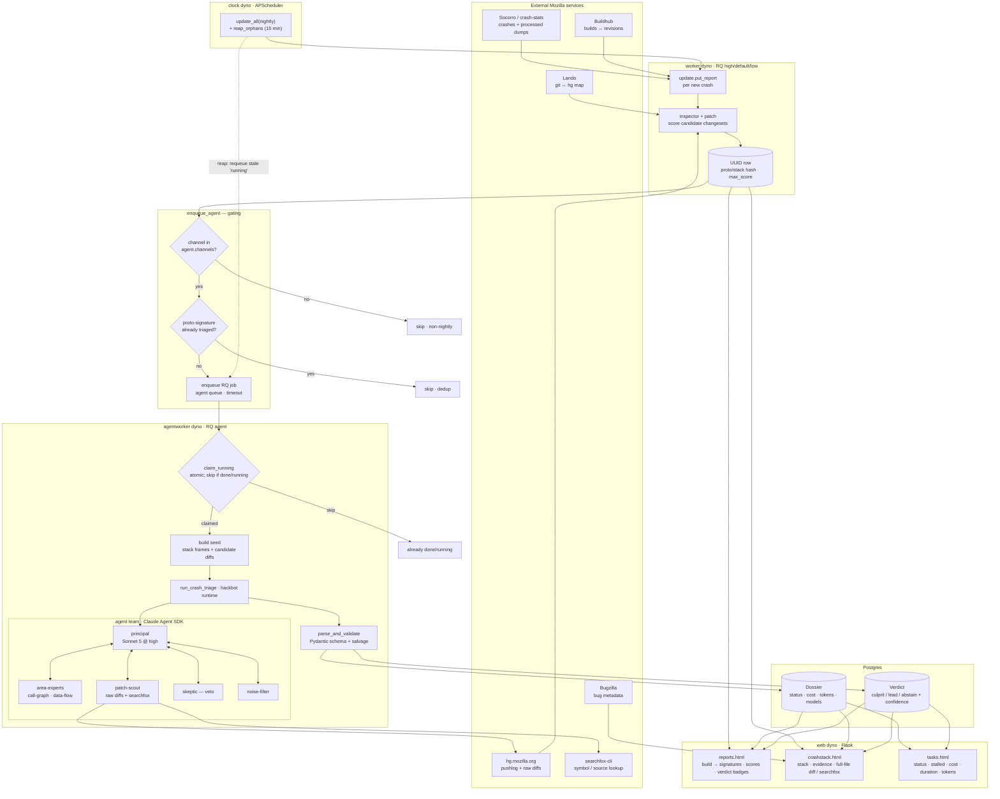

<!-- This Source Code Form is subject to the terms of the Mozilla Public
     License, v. 2.0. If a copy of the MPL was not distributed with this file,
     You can obtain one at http://mozilla.org/MPL/2.0/. -->

# Architecture: crash report → view

This is the end-to-end flow of the LLM-agent-augmented crash-clouseau, from
ingesting a crash to what the operator sees in the UI. The dyno boundaries
(`clock`, `worker`, `agentworker`, `web`) match the `Procfile`.

## Walkthrough

1. **Ingest (clock → worker).** The `clock` dyno periodically runs
   `update.update_all` scoped to the configured channels (`$INGEST_CHANNELS`,
   default `nightly`). For each new crash `update.put_report` writes a `UUID`
   row and `inspector` + `patch` score the candidate changesets (raw hg diffs,
   `git → hg` mapping via Lando), recording `max_score`.

2. **Gate (`enqueue_agent`).** Before spending an LLM run the crash passes two
   gates: it must be on an **agent channel** (nightly), and its
   **proto-signature** must not already have a completed dossier (dedup). Only
   then is an RQ job queued on the `agent` queue with a job timeout.

3. **Triage (agentworker).** The worker **atomically claims** the run
   (`claim_running` — skips anything already done or running, so dyno restarts
   don't double-pay), builds a seed from the crash stack + candidate diffs, and
   runs the agent team via the hackbot runtime: a principal (Sonnet 5 @ high)
   coordinating area-experts (call-graph / data-flow), patch-scout (raw diffs +
   searchfox), a skeptic (veto) and a noise-filter. The result is validated
   against the Pydantic schema and persisted as a **Dossier** (status, cost,
   tokens, models) plus a **Verdict** (culprit / lead / abstain + confidence).

4. **Resilience.** A `reap_orphans` job (every 15 min, same threshold as the
   tasks view's "stalled") requeues `running` dossiers whose worker died past
   `job_timeout` + buffer — the dotted feedback edge.

5. **Views (web).** `reports.html` shows a build's signatures with candidate
   scores and verdict badges; `crashstack.html` shows the stack, the agent's
   evidence/citations and the full-file diff (or searchfox); `tasks.html` is the
   operational view of the runs themselves — status, stalled, cost, duration and
   tokens, with a fleet summary.
